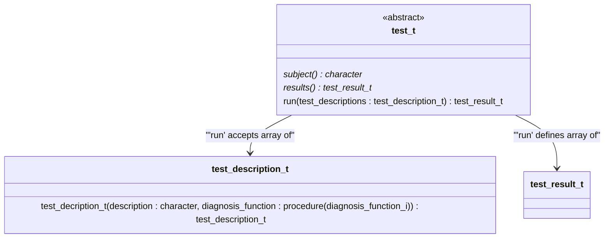
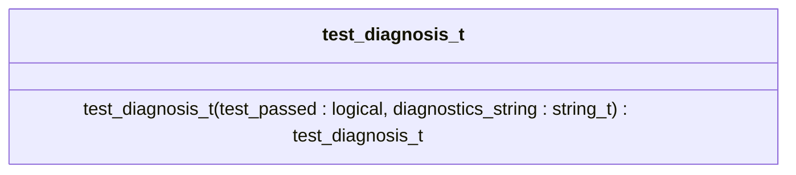
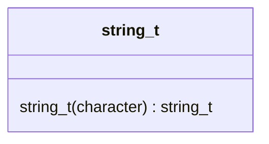
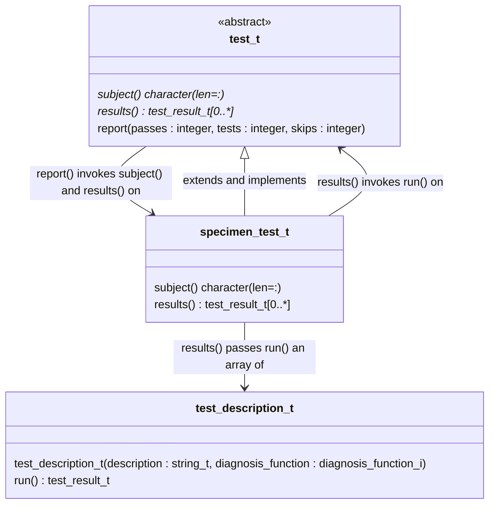
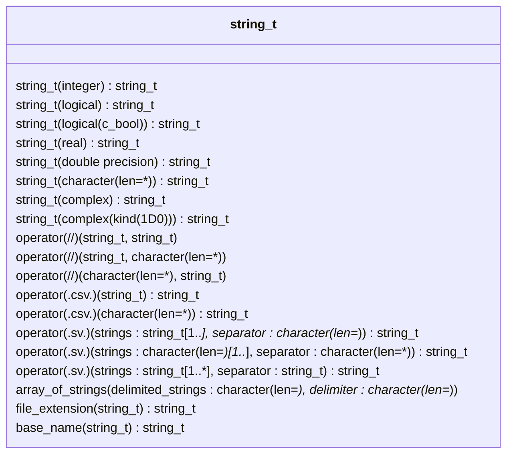

Getting Started
===============
This `demo` directory contains a demonstration project with

* Stub types and functions in the `src` subdirectory,
* Tests for the stubs in the `test` subdirectory,
* A Fortran Package Manager (`fpm`) build/test system in `fpm.toml`.

Please try [running the demonstration tests] and [generating test scaffolding].

Writing tests
-------------
Testing with Julienne centers around the `test_t` abstract derived type.
Users extend `test_t`, definoing non-abstract child types capturing groups of tests.
Doing so requires defining the inherited deferred bindings: the `subject` and `results` functions.

* `subject` has no argumetns and defines a `character` string result describing what is being tested,
* `results` has no arguments defines a `test_result_t` array result by invoking the inherited `run` function on a child instance, and
* `run` uses a `test_descripton_t` array argument to construct a `test_result_t` array result.

Users construct each `test_description_t` array element by invoking a `test_description_t` constructor function, which has two arguments:

* A `character` string describing whata the test does, typically beginning with a gerund: a word ending in `-ing`, and
* The name of a function conforming to Julienne's `diagnosis_function_i` abstract interface.

The `diagnosis_function_i` function implementations have no arguments and construct a `test_diagnosis_t` result by

* Writing an expression in a Julienne idiom with defined operations (.e.g, `.all.(['a','b','c'] .isBefore. 'efg')`) or
* Invoking the `test_diagnosis_t` constructor if no convenient idiom exists.

The `test_diagnosis_t` constructor has two arguments:

* `test_passed`: `logical` expression defining the test condition (.e.g, `
* `diagnostics_string`: a `string_t` or `character`.  Please see [Forming Diagnostics Strings] and [String-Handling Functions].
  
Please see the `test` subdirectory for code examples.
Also, please see the following Unified Modeling Language ([UML]) class diagram for a summary of user-facing derived types, including type relationships and object constructors.
Users invoke constructor functions via generic names matching the type of the constructed object result.







Running the demonstration tests
-------------------------------
With the Fortran Package Manager (`fpm`) installed, please set the `demo` subdirectory as your present working directory in a shell.
Then run the demonstration test suite using the command below for your compiler.

|Vendor | Version(s) Tested                   | Example shell command                            |
|-------|-------------------------------------|--------------------------------------------------|
|LLVM   | 20.1.8, 21.1.0                      | `fpm test --compiler flang-new --flag "-O3"`     |
|GCC    | 13.4.0<sup>1</sup>, 14.3.0, 15.1.0  | `fpm test --compiler gfortran --profile release` |
|NAG    | 7.2 Build 7235                      | `fpm test --compiler nagfor --flag "-O3 -fpp"`   |
|Intel  | 2025.1.0 Build 20250728             | `fpm test --compiler ifx --flag "-fpp -O3"`      |

<sup>1</sup>With GCC 13, please append `--flag "-ffree-line-length-none"` to the listed `fpm test` command.

Generating test scaffolding
---------------------------
To recreate the `test` directory contents, pass the following `test-suite.json` file to Julienne's `scaffold` program:
```
{
    "test suite": {
        "test subjects" : ["specimen","widget"]
    }
}
```
Please maintain the above format by not inserting, deleting, or combining any lines.
Please run following command in a `bash` or `zsh` shell with Julienne's source-tree roottree as your present working directory:
```
fpm run scaffold \
  --compiler flang-new \
  -- --json-file demo/test-suite.json \
  --suite-path demo/test
```
where a similar command works with the other supported compilers after changing
the command-line arguments to mirror those used the source-tree root directory's
[README.md](../README.md) file.  The above `fpm` command generates the files in 
the `demo/test` subdirectory of the following `demo` source tree:
```
demo
├── src
│   ├── specimen_m.f90
│   └── widget_m.f90
├── test
    ├── driver.f90
    ├── specimen_test_m.f90
    └── widget_test_m.f90
```
The modules inside the `specimen_test_m.f90` and `widget_test_m.f90` files each contain three tests: 
1. One test intentionally fails and demonstrates the construction of a test
   diagnosis via an idiom using Julienne's defined operations:
   ```
   test_diagnosis = .all.([22./7., 3.14159] .approximates. pi .within. 0.001)
   ```
   The resulting failure of the first approximation (`22./7.`) generates a
   diagnostic message for that approximation only.
2. Another test demonstrates the use of the `test_diagnosis_t()` user-defined
   structure constructor, which supports tasks that cannot be conveniently
   expressed with the operators defined in the README.md file in the root of
   Julienne's source tree.
   ```
   test_diagnosis = test_diagnosis_t(test_passed = 1 == 1, diagnostics_string = 'craziness ensued')

   ```
3. A third test demonstrates how to skip a test by not including a diagnosis
   function in the corresponding test description, which is useful when a test
   is known to crash with a specific build configuration for example.

The driver program imports the `test_t` child types.
The driver then constructs a `test_harness_t` object from an array of `test_fixture_t` objects.
The driver constructs `test_fixture_t` objects from structure constructors provided by the language standard for each test type.

Forming diagnostic strings
--------------------------
Julienne provides string-manipulation utilities to support the construction of
the `test_diagnosis_t` constructor's `diagnostics_string` argument.  The
`string_t` generic interface can be used to invoke various specific functions,
each of which takes an argument of a different data type, kind, or rank (TKR)
and defines a `string_t` result encapsulating a `character` representation of
the function argument.  For the currently supported TKR, please see Julienne's
online [documentation](https://berkeleylab.github.io/julienne).

An especially useful pattern for forming diagnostic strings involves invoking
Julienne's `operator(.csv.)` to form a string of comma-separated values (CSV)
from a one-dimensional (1D) array.  For example, consider the following test
description:
```fortran
  test_description_t("returning the counting numbers up to 3", check_counting_numbers)
```
and the following corresponding test:
```fortran
  function check_counting_numbers()
     integer, parameter :: expected_array(*) = [1, 2, 3]

     associate(actual_array => counting_numbers(max=3))
       test_diagnosis = test_diagnosis_t( &
          test_passed = all(expected_array == actual_array) &
         ,diagnostics_string = "expected " // .csv. string_t(expected_array) // "; actual  // .csv. string_t(actual_array) &
       )
     end associate
  end function
```
If the `counting_numbers` result contains all zeros, the test report would
include the following text:
```
FAILS  on returning the counting numbers up to 3
      diagnostics: expected 1,2,3; actual 0,0,0
```
To support a common array notation, Julienne also supports bracketing strings.

Diagnosis Functions
-------------------
The Unified Modeling Language ([UML]) class diagram below depicts some of the class
relationships involved in making the above example work:



Skipping Tests
--------------
When a test is known to cause a compile-time or runtime crash in a specific
scenario, e.g., with a specific compiler or compiler version, including that
test will prevent the test suite from building or running to completion.  It
can be useful to skip a test with the problematic compiler but to report the
test as skipped and account for the skipped tests in the tally of test results.
For this purpose, the `test_description_t` constructor function has an optional
`diagnosis_function` argument.  When these arguments are not `present`, the
`test_t`'s `report` procedure will report the test as skipped but will terminate
normally as long as the sum of the passing tests and skipped tests equals the
total number of tests.  One might accomplish this with the compiler's predefined
preprocessor macro:
```
#ifndef __GFORTRAN__
      ,test_description_t('constructing bracketed strings', brackets_strings_ptr) &
#else
      ,test_description_t('constructing bracketed strings'                      ) &
#endif
```
which presently appears in Julienne `test/string_test_m.f90` test in order to
work around a runtime crash known to be caused by a `gfortran` bug.

String-Handling Functions
-------------------------
Because of the central role that `string_t` type-bound procedures play in
defining diagnostics strings, we list most of these procedures in the class
diagram below.



[UML]: https://wikipedia.org/Unified_modeling_language
[running the demonstration tests]: #running-the-demonstration-tests
[generating test scaffolding]: #generating-test-scaffolding
[Forming Diagnostics Strings]: #forming-diagnostics-strings
[String-Handling Functions]: #string-handling-functions
