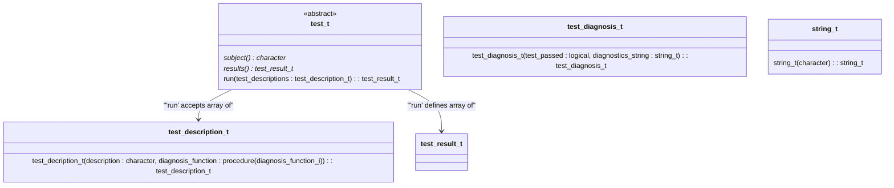
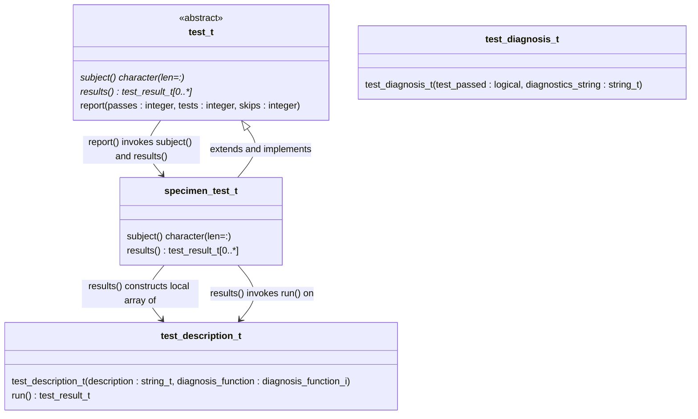
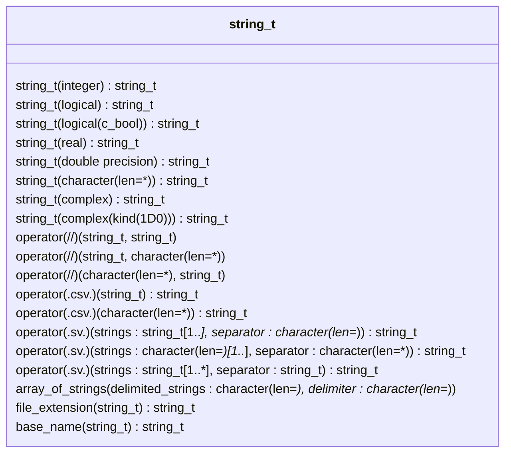

Getting Started
===============
This `demo` directory contains a demonstration project with

* Stub types and functions in the `src` subdirectory and
* Tests for the stubs in the `test` subdirectory.

Please try [running the demonstration tests] and [generating test scaffolding].

Writing tests
-------------
Testing centers around Julienne's `test_t` abstract derived type.
Users define non-abstract `test_t` child types to capture groups of tests.
Doing so requires defining the inherited deferred bindings: `subject` and `results`.
The `subject` function defines a `character` string result describing what is being tested.
The `results` function defines a `test_result_t` array result by invoking the inherited `run` procedure on an instance of the child type.
The `run` function accepts a `test_descripton_t` array argument and constructs the `test_result_t` array.

Users construct the `test_description_t` array by invoking a `test_description_t` constructor for each array element and passing each constructor invocation two arguments:

* A `character` test description typically beginning with a gerund: a word ending in `-ing` and
* The name of a function conforming to Julienne's `diagnosis_function_i` abstract interface.

Users define functions conforming to the `diagnosis_function_i` interface: functions with no arguments and with a `test_diagnosis_t` result.
Constructing a the function result involves either

* Invoking the `test_diagnosis_t` constructor or
* Writing an expression in a Julienne idiom using Julienne's defined operations.

The `test_diagnosis_t` constructor takes two arguments.
The first is usually a `logical` expression defining the test condition.
The second is a diagnostics string of type `string_t` or `character`.
Please see the `test` subdirectory for code examples.
Also, please see the following Unified Modeling Language ([UML]) class diagram for a summary of user-facing derived types, including type relationships and object constructors.
Users invoke constructor functions via generic names matching the type of the constructed object result.



Running the demonstration tests
-------------------------------
With the Fortran Package Manager (`fpm`) installed and the `demo`
subdirectory as your present working directory in a shell, run
the demonstration test suite using the command corresponding to
your compiler in the table below.

|Vendor | Version(s) Tested       | Example shell command                            |
|-------|-------------------------|--------------------------------------------------|
|LLVM   | 20.1.8                  | `fpm test --compiler flang-new --flag "-O3"`     |
|GCC    | 14.3.0, 15.1.0          | `fpm test --compiler gfortran --profile release` |
|NAG    | 7.2 Build 7235          | `fpm test --compiler nagfor --flag -fpp`         |
|Intel  | 2025.1.0 Build 20250728 | `fpm test --compiler ifx --flag "-fpp -O3"`      |

Generating test scaffolding
---------------------------
The `demo/test` subdirectory contains tests generated by first creating a
`test-suite.json` file with the following contents:
```
{
    "test suite": {
        "test subjects" : ["specimen","widget"]
    }
}
```
The current file reader is fragile. It is recommended to maintain the
above file structure, keeping the array on one line.

Entering the following command in a `zsh` shell with the present working
directory set to the root of Julienne's source tree:
```
fpm run scaffold \
  --compiler flang-new \
  -- --json-file demo/test-suite.json \
  --suite-path demo/test
```
which generates the following directory tree and files inside `demo`:
```
demo
├── src
│   ├── specimen_m.f90
│   └── widget_m.f90
├── test
    ├── driver.f90
    ├── specimen_test_m.f90
    └── widget_test_m.f90
```
The modules inside the `specimen_test_m.f90` and `widget_test_m.f90` files each
contain three tests: 
1. One test intentionally fails and demonstrates the construction of a test
   diagnosis via an idiom using Julienne's defined operations:
   ```
   test_diagnosis = .all.([22./7., 3.14159] .approximates. pi .within. 0.001)
   ```
   The resulting failure of the first approximation (`22./7.`) generates a
   diagnostic message for that approximation only.
2. Another test demonstrates the use of the `test_diagnosis_t()` user-defined
   structure constructor, which supports tasks that cannot be conveniently
   expressed with the operators defined in the README.md file in the root of
   Julienne's source tree.
   ```
   test_diagnosis = test_diagnosis_t(test_passed = 1 == 1, diagnostics_string = 'craziness ensued')

   ```
3. A third test demonstrates how to skip a test by not including a diagnosis
   function in the corresponding test description, which is useful when a test
   is known to crash with a specific build configuration for example.

The driver program imports the `test_t` child types.
The driver then constructs a `test_harness_t` object from an array of `test_fixture_t` objects.
The driver constructs `test_fixture_t` objects from structure constructors provided by the compiler for each test type.

Forming diagnostic strings
--------------------------
Julienne provides string-manipulation utilities to support the construction of
the `test_diagnosis_t` constructor's `diagnostics_string` argument.  The
`string_t` generic interface can be used to invoke various specific functions,
each of which takes an argument of a different data type, kind, or rank (TKR)
and defines a `string_t` result encapsulating a `character` representation of
the function argument.  For the currently supported TKR, please see Julienne's
online [documentation](https://berkeleylab.github.io/julienne).

An especially useful pattern for forming diagnostic strings involves invoking
Julienne's `operator(.csv.)` to form a string of comma-separated values (CSV)
from a one-dimensional (1D) array.  For example, consider the following test
description:
```fortran
  test_description_t("returning the counting numbers up to 3", check_counting_numbers)
```
and the following corresponding test:
```fortran
  function check_counting_numbers()
     integer, parameter :: expected_array(*) = [1, 2, 3]

     associate(actual_array => counting_numbers(max=3))
       test_diagnosis = test_diagnosis_t( &
          test_passed = all(expected_array == actual_array) &
         ,diagnostics_string = "expected " // .csv. string_t(expected_array) // "; actual  // .csv. string_t(actual_array) &
       )
     end associate
  end function
```
If the `counting_numbers` result contains all zeros, the test report would
include the following text:
```
FAILS  on returning the counting numbers up to 3
      diagnostics: expected 1,2,3; actual 0,0,0
```
To support a common array notation, Julienne also supports bracketing strings.

Diagnosis Functions
-------------------
The Unified Modeling Language ([UML]) class diagram below depicts the class
relationships involved in making the above example work:



Skipping Tests
--------------
When a test is known to cause a compile-time or runtime crash in a specific
scenario, e.g., with a specific compiler or compiler version, including that
test will prevent the test suite from building or running to completion.  It
can be useful to skip a test with the problematic compiler but to report the
test as skipped and account for the skipped tests in the tally of test results.
For this purpose, the `test_description_t` constructor function has an optional
`diagnosis_function` argument.  When these arguments are not `present`, the
`test_t`'s `report` procedure will report the test as skipped but will terminate
normally as long as the sum of the passing tests and skipped tests equals the
total number of tests.  One might accomplish this with the compiler's predefined
preprocessor macro:
```
#ifndef __GFORTRAN__
      ,test_description_t('constructing bracketed strings', brackets_strings_ptr) &
#else
      ,test_description_t('constructing bracketed strings'                      ) &
#endif
```
which presently appears in Julienne `test/string_test_m.f90` test in order to
work around a runtime crash known to be caused by a `gfortran` bug.

String_t Functions
------------------
Because of the central role that `string_t` type-bound procedures play in
defining diagnostics strings, we list most of these procedures in the class
diagram below.



[UML]: https://wikipedia.org/Unified_modeling_language)
[running the demonstration tests]: #running-the-demonstration-tests
[generating test scaffolding]: #generating-test-scaffolding
