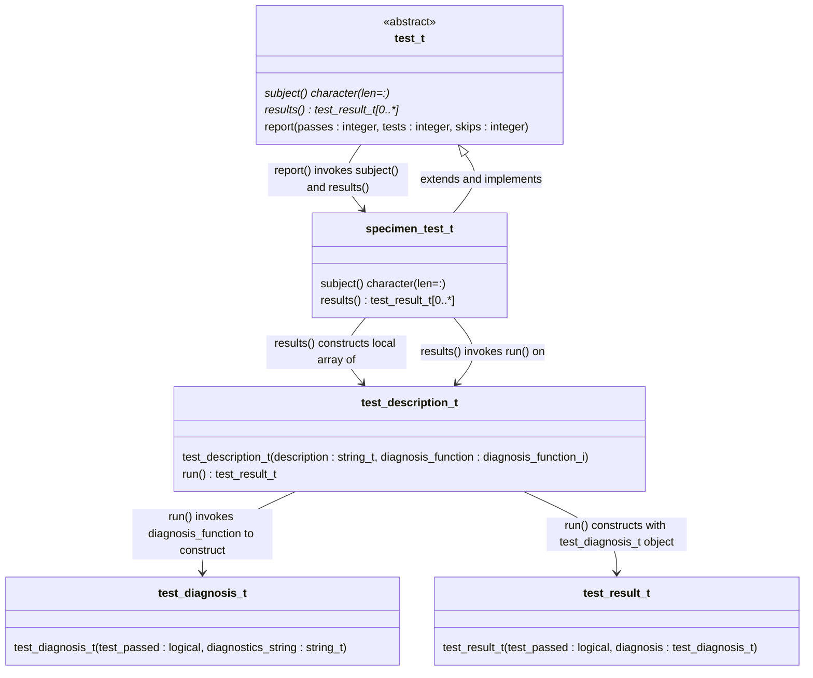
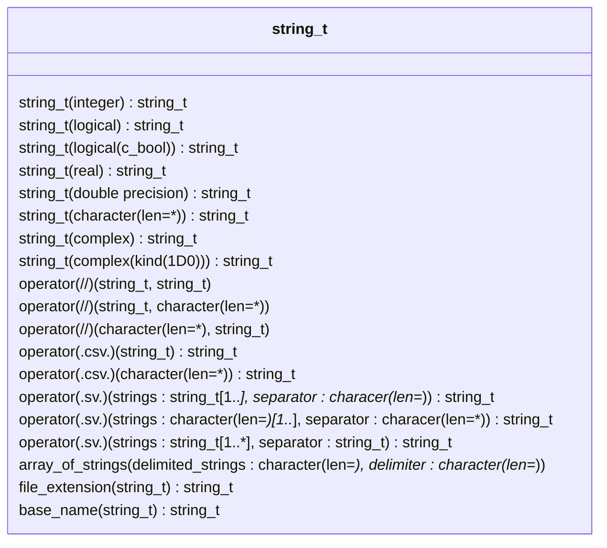
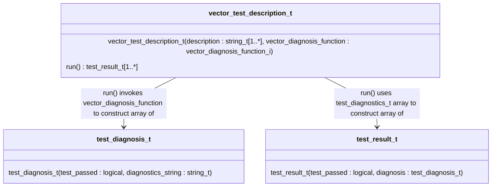

Getting Started
===============
To get started with Julienne, review and test the demonstration project in this directory.
Then copy the `main.f90` and `specimen_test_m.f90` files to your project's test directory.
Finally, modify the files as described below to adapt them to your project.

Testing the Demonstration Project
--------------------------------
This demonstration project defines a trivial library named "specimen" in the `src`
subdirectory and a test suite in the `test` subdirectory.  The test suite includes five tests:

1. Three tests pass.
2. One test intentionally fails to demonstrate diagnostic output.
3. One test is skipped to demonstrate the reporting and tallying of skipped tests.

Test Julienne by setting your present working directory to the `demo/` subdirectory in a
terminal window and then building and running the demonstration project's test suite using
the command corresponding to your compiler in the table below.

|Vendor   | Version/Build Tested    | Example shell command                                |
|---------|-------------------------|------------------------------------------------------|
|LLVM     | 20.1.4                  | `fpm test --compiler flang-new`                      |
|GCC      | 14.3.0                  | `fpm test --compiler gfortran --profile release`     |
|NAG      | 7.2 Build 7235          | `fpm test --compiler nagfor --flag -fpp`             |
|Intel    | 2025.1.0 Build 20250317 | `fpm test --compiler ifx --flag "-fpp -O3 -coarray"` |

Setting Up Your Project's Test Suite
------------------------------------

1. If you build your project with the Fortran Package Manager ([`fpm`](https://github.com/fotran-lang/fpm)), then you might copy the `main.f90` and `specimen_test_m.f90` files from this subdirectory to a `test/` subdirectory in the root of your project's source tree.
2. Rename the `specimen_test_m.f90` file, the `specimen_test_m` module, and the `specimen_test_t` derived type and any references thereto, replacing `specimen` with the name of an entity that you intend to test -- most likely a module containing procedures or derived type with type-bound procedures.
3. Similarly replace occurrences of `specimen` in the resulting`test/main.f90` file.
4. In the `results()` function body of your new `*_test_m.f90` file, replace the `test_descriptions_t` array constructor elements with your own test descriptions.  The test output will read most naturally if your description string (the first argument) contains a gerund: a verb ending in "ing" and used as a noun, such as `producing` above.
5. Replace the function name (the second argument) with the name of a function that will perform your test.
7. Edit the correspondingly-renamed function to perform the test.  The function must take no arguments and define a `test_diagnosis_t` result.

The functions in `specimen_test_m` demonstrate several common options for constructing a `test_diagnosis_t` as the diagnosis function result.
The options include

1. Writing an expression using Julienne's operators such as `.approximate.`, `.within`., and `.equalsExpected.`.
2. Invoking the `test_diagnosis_t` constructor and using Julienne's `string_t` constructors to form a diagnostic string.

`String_t` is a generic interface to various specific functions, each of which takes an argument of a different data type, kind, and rank (TKR) and defines a `string_t` result containing a charater representation of the function argument.
Please see Julienne's online [documentation](https://berkeleylab.github.io/julienne) for the currently supported TKR.
Please submit an issue to request support for additional TKR or submit a pull request to contribute such support.

#### Forming diagnostic strings from array data

An especially useful pattern for forming diagnostic strings involves invoking Julienne's `operator(.csv.)` to produce a string of comma-separated values (CSV) from a one-dimensional (1D) array.
For example, consider the following test description:
```fortran
  test_description_t("returning the counting numbers up to 3", check_counting_numbers)
```
and the following corresponding test:
```fortran
  function check_counting_numbers()
     integer, parameter :: expected_array(*) = [1, 2, 3]

     associate(actual_array => counting_numbers(max=3))
       test_diagnosis = test_diagnosis_t( &
          test_passed = all(expected_array == actual_array) &
         ,diagnostics_string = "expected " // .csv. string_t(expected_array) // "; actual  // .csv. string_t(actual_array) &
       )
     end associate
  end function
```
If the `counting_numbers` result contains all zeros, the test report would include the following text:
```
FAILS  on returning the counting numbers up to 3
      diagnostics: expected 1,2,3; actual 0,0,0
```
To support a common array notation, Julienne also supports bracketing strings.

Diagnosis Functions
-------------------
The Unified Modeling Language ([UML](https://wikipedia.org/Unified_modeling_langauge)) class diagram below depicts the class relationships involved in making the above example work:



Skipping Tests
--------------
When a test is known to cause a compile-time or runtime crash in a specific scenario, e.g., with a specific compiler or compiler version, including that test will prevent the test suite from building or running to completion.
It can be useful to skip a test with the problematic compiler but to report the test as skipped and account for the skipped tests in the tally of test results.
For this purpose, the `test_description_t` and `vector_test_description_t` constructor functions have optional second arguments `diagnosis_function` and `vector_diagnosis_function`, respectively.
When these arguments are not `present`, the `test_t`'s `report` procedure will report the test as skipped but will terminate normally as long as the sum of the passing tests and skipped tests equals the total number of tests.
One might accomplish this with the compiler's predefined preprocessor macro:
```
#ifndef __GFORTRAN__
      ,test_description_t('constructing bracketed strings', brackets_strings_ptr) &
#else
      ,test_description_t('constructing bracketed strings'                      ) &
#endif
```
which presently appears in Julienne `test/string_test_m.f90` test in order to work around a runtime crash known to be caused by a `gfortran` bug.

String_t Functions
------------------
Because of the central role that `string_t` type-bound procedures play in defining diagnostics strings, we list most of these procedures in the class diagram below.



Deprecated: Vector Diagnosis Function
-------------------------------------
Julienne's `vector_diagnosis_function_i` abstract interface and the corresponding `vector_test_description_t` type were developed before Julienne's `operator(.all.)` and `operator(.and.)`.
Because the operators replace the interface and type with simpler functionality, it is likely that a future release will remove the `vector_*` entities.

The Unified Modeling Language ([UML](https://wikipedia.org/Unified_modeling_language)) class diagram below depicts the class relationships involved when test function performs multiple checks and defines a result containing an array of corresponding `test_diagnosis_t` objects:

