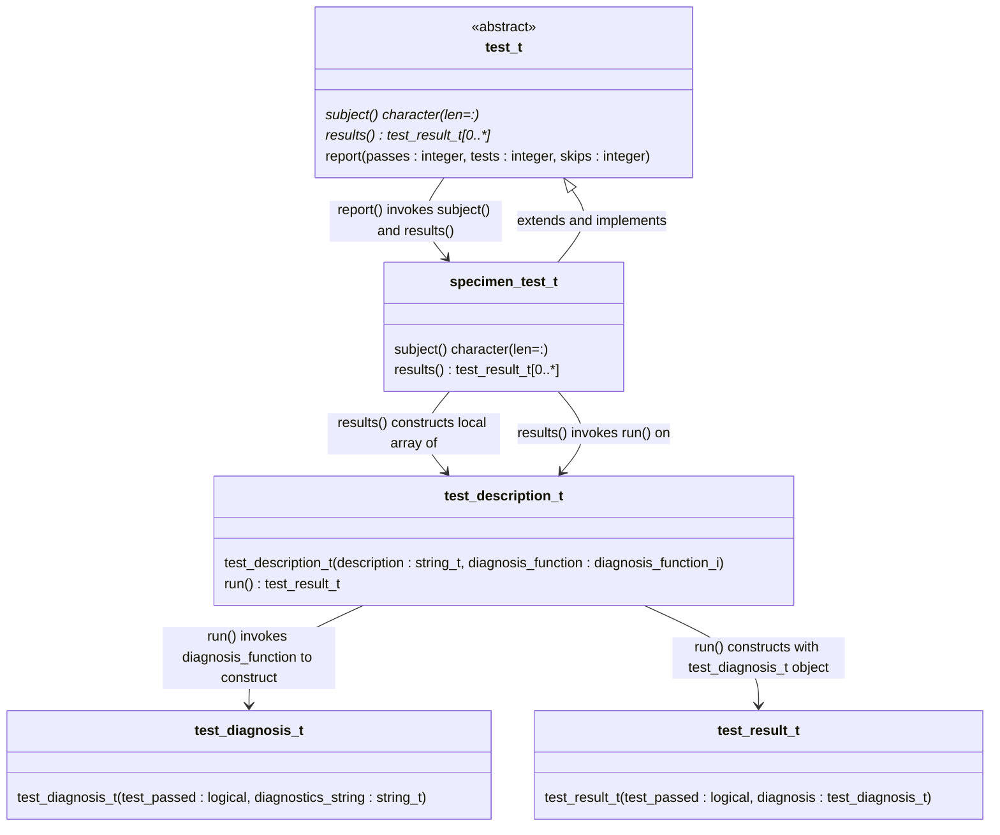
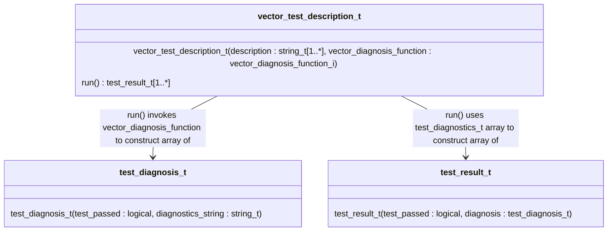
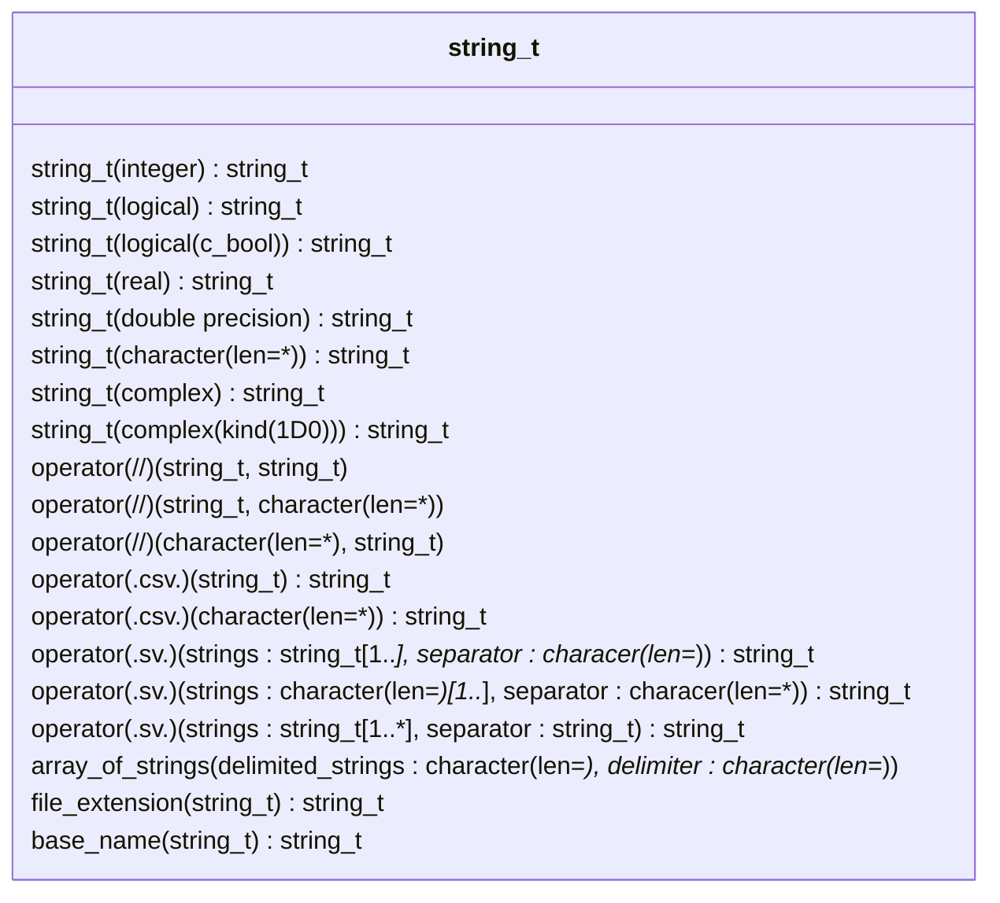

Example Test Suite Classes
==========================

Getting Started
---------------
Likely the fastest way to get started with Julienne is to copy the source code in this directory and modify it for your purposes:

1. If you build your project with the Fortran Package Manager ([`fpm`](https://github.com/fotran-lang/fpm)), then you might move the `main.F90` and `specimen_test_m.F90` files from this subdirectory to a `test/` subdirectory in the root of your project's source tree.
2. Rename the `specimen_test_m.F90` file, the `specimen_test_m` module, and the `specimen_test_t` derived type and any references thereto, replacing `specimen` with the name of an entity that you intend to test -- most likely a module containing procedures or derived type with type-bound procedures.
3. Similarly replace occurrences of `specimen` in the resulting`test/main.F90` file.
4. Modify the `test_descriptions_t` array constructor in your new `*_test_m.F90` file, adding elements for each test to be performed:
```fortran
  test_descriptions = [ &
    test_description_t("the type-bound function zero() producing a result of 0", check_zero) &
  ]
```
5. Replace the above string (`"the type-bound..."`) with a description of your intended test.  The test output will read most naturally if your description contains a gerund: a verb ending in "ing" and used as a noun, such as `producing` above.
6. Replace the `check_zero` function name with the name of a function that will perform your test.
7. Edit the correspondingly-renamed function to perform the test.  The function must take no arguments and define a `test_diagnosis_t` result. An example result might be the following:
```fortran
  test_diagnosis = test_diagnosis_t( &
     test_passed = actual_value == expected_value &
    ,diagnostics_string = "expected value " // string_t(expected_value) //", actual value " // string_t(actual_value) &
  )
```
The above `test_diagnosis_t` constructor function invocation demonstrates the recommended pattern for writing tests with Julienne:

* Define the `test_passed` keyword argument by writing an expression that will evaluate to `.true.` if and only if the test succeeds.
* Define the `diagnostics_string` keyword argument from character literal values interspersed with`string_t` constructor, all strung together by instances of the string concatenation operator `//`.

`String_t` is a generic interface to various specific functions, each of which takes an argument of a different data type, kind, and rank (TKR) and defines a `string_t` result containing a charater representation of the function argument.
Please see Julienne's online [documentation](https:///berkeleylab.github.io/julienne/) for the currently supported TKR.
Please submit an issue to request support for additional TKR or submit a pull request to contribute such support.

#### Forming diagnostic strings from array data

An especially useful pattern for forming diagnostic string involves invoking Julienne's `operator(.csv.)` to produce a string of comma-separated values (CSV) from a one-dimensional (1D) array.
For example, consider the following test description:
```fortran
  test_description_t(" returning the counting numbers up to 3", check_counting_numbers)
```
and the following corresponding test:
```fortran
  function check_counting_numbers()
     integer, parameter :: expected_array(*) = [1, 2, 3]

     associate(actual_array => counting_numbers(max=3))
       test_diagnosis = test_diagnosis_t( &
          test_passed = all(expected_array == actual_array) &
         ,diagnostics_string = "expected " // .csv. string_t(expected_array) // "; actual  // .csv. string_t(actual_array) &
       )
     end associate
  end function
```
If the `counting_numbers` result contains all zeros, the test report would include the following text:
```
FAILS  on returning the counting numbers up to 3
      diagnostics: expected 1,2,3; actual 0,0,0
```
To support a common array notation, Julienne also supports bracketing strings.

**Exercise 1:** Make `check_counting_numbers` more robust by testing the equivalence of `expected_array` and `actual_array` only if the array sizes match and by treating a size-mismatch as a test failure.

**Exercise 2:** Revise `check_counting_numbers` by defining CSV strings `expected_string` and `actual_string` _before_ invoking `test_diagnostics_t`.
Bracket the CSV strings in the `diagnostics_string` keyword argument by invoking `bracket` type-bound procedure, e.g., `expected_string%bracket()`.

Scalar Diagnosis Function
-------------------------
The Unified Modeling Language ([UML](https://wikipedia.org/Unified_modeling_langauge)) class diagram below depicts the class relationships involved in making the above example work:



Vector Diagnosis Function
-------------------------
The UML class diagram below depicts the class relationships involved when test function performs multiple checks and defines a result containing an array of corresponding `test_diagnosis_t` objects:


Skipping Tests
--------------
When a test is known to cause a compile-time or runtime crash in a specific scenario, e.g., with a specific compiler or compiler version, including that test will prevent the test suite from building or running to completion.
It can be useful to skip a test with the problematic compiler but to report the test as skipped and account for the skipped tests in the tally of test results..
For this purpose, the `test_description_t` and `vector_test_description_t` constructor functions have optional second arguments `diagnosis_function` and `vector_diagnosis_function`, respectively.
When these arguments are not `present`, the `test_t`'s `report` procedure will report the test as skipped but will terminate normally as long as the sum of the passing tests and skipped tests equals the total number of tests.
One might accomplish this with the compiler's predefined preprocessor macro:
```
#ifndef __GFORTRAN__
      ,test_description_t('constructing bracketed strings', brackets_strings_ptr) &
#else
      ,test_description_t('constructing bracketed strings'                      ) &
#endif
```
which presently appears in Julienne `test/string_test_m.F90` test in order to work around a runtime crash known to be caused by a `gfortran` bug.

String_t Functions
------------------
Because of the central role that `string_t` type-bound procedures play in defining diagnostics strings, we list most of these procedures in the class diagram below.


